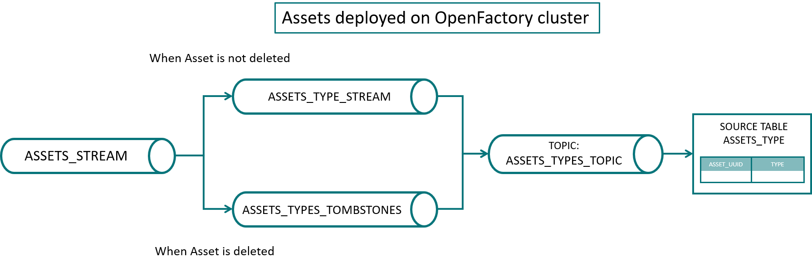
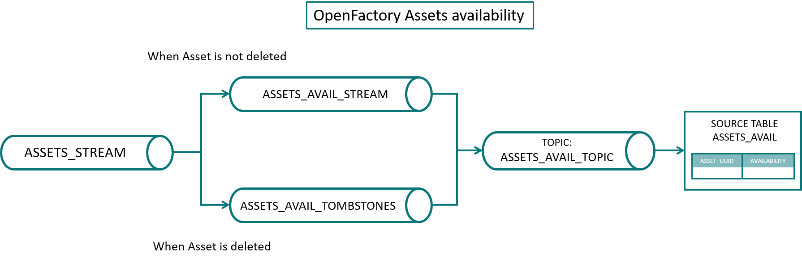

# KSQL Initial Structures  

This folder contains the ksqlDB scripts used to create the initial streams and tables required by OpenFactory.  

## OpenFactory Assets

The script [mtcdevices.sql](mtcdevices.sql) defines various streams, tables and toplogies.

### Main topology

- **`ASSETS_STREAM`**: A stream containing all Kafka messages from the `ofa_assets` topic, which is used by the Kafka producers of the deployed assets in OpenFactory.
- **`ENRICHED_ASSETS_STREAM`**: A derived stream rekeying `ASSETS_STREAM` with the composite key `ASSET_UUID`|`ID`.
- **`ASSETS`**: A table listing by asset the current values of each `ID`.

The `ASSETS` table represents the current state of all deployed assets in OpenFactory.

### Topology for the deployed assets in OpenFactory


- **`ASSETS_TYPE_STREAM`**: A derived stream that selects only the AssetType entries of `ASSETS_STREAM`.
- **`ASSETS_TYPE_TOMBSTONES`**: A stream ensuring that any Kafka message in the `ofa_assets` topic (or equivalently in the `ASSETS_STREAM`) with an AssetType value of `delete` produces a ksqlDB tombstone message (i.e., removes its entry from the topology).
- **`ASSETS_TYPE`**: A table listing the type of assets deployed in OpenFactory.

The `ASSETS_TYPE` lists the type of all assets currently deployed on OpenFactory.

### Topology for the status of the availability of the devices:



- **`ASSETS_AVAIL_STREAM`**: A derived stream that selects only the availability entries of `ASSETS_STREAM`.
- **`ASSETS_AVAIL_TOMBSTONES`**: A stream ensuring that any Kafka message in the `ofa_assets` topic (or equivalently in the `ASSETS_STREAM`) with an availability value of `delete` produces a ksqlDB tombstone message (i.e., removes its entry from the topology).
- **`ASSETS_AVAIL`**: A table listing the availability status of OpenFactory assets.

The `ASSETS_AVAIL` table lists the availably status of all deployed assets on OpenFactory.

### Topology for Docker Swarm services
It further defines a topology for keeping track of the Docker Swarm services running the needed codes for an OpenFactory asset. This topology is mainly intended for internal use of OpenFactory or for tools helping monitoring the Docker Swarm services on the OpenFactory cluster:
- **`DOCKER_SERVICES_STREAM`**: A derived stream that selects only the `DockerService` entries of `ASSETS_STREAM`.
- **`DOCKER_SERVICES`**: A table listing the Docker Swarm services of OpenFactory assets.

### How to List the Current State of an Asset

To list the current sate of all dataItems of an asset, query the table `ASSETS`:
```sql
SELECT * FROM assets WHERE ASSET_UUID='ASSET-UUID';
```

In case a specific dataItem of an asset is to be queried, the most efficient syntax is
```sql
SELECT * FROM assets WHERE key='ASSET-UUID|DATA_ITEM_ID';
```
where `DATA_ITEM_ID` is the ID of the dataItem one wants to obtain the current state.

### How to List the Assets Deployed in OpenFactory
To list the assets deployed in OpenFactory query the table `ASSETS`:
```sql
SELECT * FROM assets;
```

### How to List the Availability of Assets Deployed in OpenFactory
To list the availability assets deployed in OpenFactory query the table `ASSETS_AVAIL`:
```sql
SELECT * FROM assets_avail;
```

#### Note:
An asset can be deployed while being unavailable. For example, a sensor can have all its services deployed,
but still be unavailable (if the MTConnect Agent and Kafka Producer are deployed, but the adapter is not running)

### How to Remove a Row in `ASSETS`  

#### Using ksqlDB  

Insert a message into the `ASSETS_STREAM` like this:  

```sql
INSERT INTO assets_stream (asset_uuid, id, value, type)
VALUES ('ASSET-UUID', 'AssetType', 'delete', 'OpenFactory');
```
where `ASSET-UUID` is the UUID of the asset whose entry should be removed from the `ASSETS` table.  

#### Using Python  

Insert a tombstone message into the topic associated with the `ASSETS` table:  

```python
from confluent_kafka import Producer
from openfactory.kafka import KSQLDBClient
import openfactory.config as config

asset_uuid = 'ASSET-UUID'
ksql = KSQLDBClient(config.KSQLDB_URL)
prod = Producer({'bootstrap.servers': config.KAFKA_BROKER})
prod.produce(topic=ksql.get_kafka_topic('assets'),
             key=asset_uuid.encode('utf-8'),
             value=None)
prod.flush()
```

### How to Remove a Row in `ASSETS_AVAIL`  

#### Using ksqlDB  

Insert a message into the `ASSETS_STREAM` like this:  

```sql
INSERT INTO assets_stream (asset_uuid, id, value)
VALUES ('ASSET-UUID', 'avail', 'delete');
```

where `ASSET-UUID` is the UUID of the asset whose availability status should be removed from the `ASSETSS_AVAIL` table.  

#### Using Python  

Insert a tombstone message into the topic associated with the `ASSETS_AVAIL` table:  

```python
from confluent_kafka import Producer
from openfactory.kafka import KSQLDBClient
import openfactory.config as config

asset_uuid = 'ASSET-UUID'
ksql = KSQLDBClient(config.KSQLDB_URL)
prod = Producer({'bootstrap.servers': config.KAFKA_BROKER})
prod.produce(topic=ksql.get_kafka_topic('assets_avail'),
             key=asset_uuid.encode('utf-8'),
             value=None)
prod.flush()
```  
