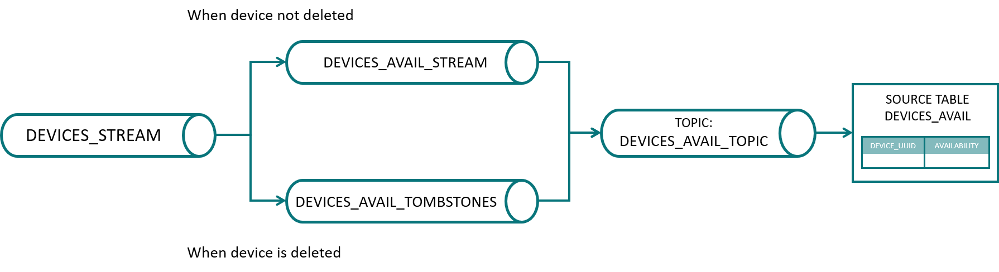

# KSQL Initial Structures  

This folder contains the ksqlDB scripts used to create the initial streams and tables required by OpenFactory.  

## MTCDevice  

The script [mtcdevices.sql](mtcdevices.sql) defines the following ksqlDB streams and tables for the data of the devices:  

- **`DEVICES_STREAM`**: A stream containing all Kafka messages from the `mtc_devices` topic, which is used by the Kafka producers of the deployed devices in OpenFactory.
- **`REKEYED_DEVICES_STREAM`**: A derived stream rekeying `DEVICES_STREAM` with the composite key `DEVICE_UUID`-`ID`.
- **`DEVICES`**: A table listing by device the current values of each `ID`.

defines the following ksqlDB stream topology for the deployed assets in OpenFactory:

- **`ASSETS_STREAM`**: A derived stream that selects only the AssetType entries of `DEVICES_STREAM`.
- **`ASSETS_TOMBSTONES`**: A stream ensuring that any Kafka message in the `mtc_devices` topic (or equivalently in the `DEVICES_STREAM`) with an AssetType value of `delete` produces a ksqlDB tombstone message (i.e., removes its entry from the topology).
- **`ASSETS`**: A table listing the type of assets deployed in OpenFactory.

and defines the following ksqlDB stream topology for the status of the availability of the devices:
 
- **`DEVICES_AVAIL_STREAM`**: A derived stream that selects only the availability entries of devices.
- **`DEVICES_AVAIL_TOMBSTONES`**: A stream ensuring that any Kafka message in the `mtc_devices` topic (or equivalently in the `DEVICES_STREAM`) with an availability value of `delete` produces a ksqlDB tombstone message (i.e., removes its entry from the topology).
- **`DEVICES_AVAIL`**: A table listing the availability status of OpenFactory devices.

It further defines a topology for keeping track of the Docker Swarm services running the needed codes for an OpenFactory asset. This topology is mainly inteded for internal use of OpenFactory or for tools helping monitoring the Docker Swarm services on the OpenFactory cluster:
- **`DOCKER_SERVICES_STREAM`**: A derived stream that selects only the `DockerService` entries of devices.
- **`DOCKER_SERVICES`**: A table listing the Docker Swarm services of OpenFactory devices.

### How to List the Current State of a Device

To list the current sate of all dataItems of a device, query the table `DEVICES`:

```sql
SELECT * FROM devices WHERE key LIKE 'DEVICE-UUID|%';
```
where `DEVICE-UUID` is the UUID of the device from which one wants to obtain the current state.

#### Note: 
To use instead
```sql
SELECT * FROM devices WHERE DEVICE_UUID='DEVICE-UUID';
```
would return as well the correct results, but is significantly less efficient as ksqlDB will have to scan over all
partitions of the table `DEVICES` as the table key is the field `KEY` and not `DEVICE_UUID`.

In case a specific dataItem of a device is to be queries, the most efficient syntax is
```sql
SELECT * FROM devices WHERE key='DEVICE-UUID|DATA_ITEM_ID';
```
where `DATA_ITEM_ID` is the ID of the dataItem one wants to obtain the current state.

### How to List the Assets Deployed in OpenFactory
To list the assets deployed in OpenFactory query the table `ASSETS`:
```sql
SELECT * FROM assets;
```

### How to List the Availability of Assets Deployed in OpenFactory
To list the availability assets deployed in OpenFactory query the table `DEVICES_AVAIL`:
```sql
SELECT * FROM devices_avail;
```

#### Note:
An asset can be deployed while being unavailable. For example, a sensor can have all its services deployed,
but still be unavailable (if the MTConnect Agent and Kafka Producer are deployed, but the adapter is not running)

### How to Remove a Row in `ASSETS`  

#### Using ksqlDB  

Insert a message into the `DEVICES_STREAM` like this:  

```sql
INSERT INTO devices_stream (device_uuid, id, value, type)
VALUES ('DEVICE-UUID', 'AssetType', 'delete', 'OpenFactory');
```

where `DEVICE-UUID` is the UUID of the device whose entry should be removed from the `ASSETS` table.  

#### Using Python  

Insert a tombstone message into the topic associated with the `ASSETS` table:  

```python
from confluent_kafka import Producer
from pyksql.ksql import KSQL
import openfactory.config as config

device_uuid = 'DEVICE-UUID'
ksql = KSQL(config.KSQLDB_URL)
prod = Producer({'bootstrap.servers': config.KAFKA_BROKER})
prod.produce(topic=ksql.get_kafka_topic('assets'),
             key=device_uuid.encode('utf-8'),
             value=None)
prod.flush()
```

### How to Remove a Row in `DEVICES_AVAIL`  

#### Using ksqlDB  

Insert a message into the `DEVICES_STREAM` like this:  

```sql
INSERT INTO devices_stream (device_uuid, id, value)
VALUES ('DEVICE-UUID', 'avail', 'delete');
```

where `DEVICE-UUID` is the UUID of the device whose availability status should be removed from the `DEVICES_AVAIL` table.  

#### Using Python  

Insert a tombstone message into the topic associated with the `DEVICES_AVAIL` table:  

```python
from confluent_kafka import Producer
from pyksql.ksql import KSQL
import openfactory.config as config

device_uuid = 'DEVICE-UUID'
ksql = KSQL(config.KSQLDB_URL)
prod = Producer({'bootstrap.servers': config.KAFKA_BROKER})
prod.produce(topic=ksql.get_kafka_topic('devices_avail'),
             key=device_uuid.encode('utf-8'),
             value=None)
prod.flush()
```  
