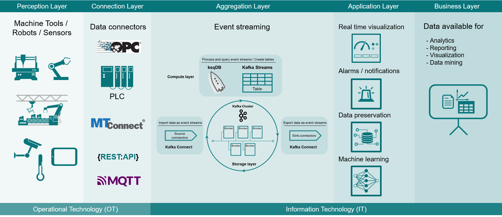

# OpenFactory

Framework for manufacturing data management

## How it works
OpenFactory streams relevant data into Kafka topics. On top of Kafka, OpenFactory runs a [ksqlDB](https://ksqldb.io/) server. The ksqlDB server allows to perform data stream processing using a language very similar to standard SQL.

