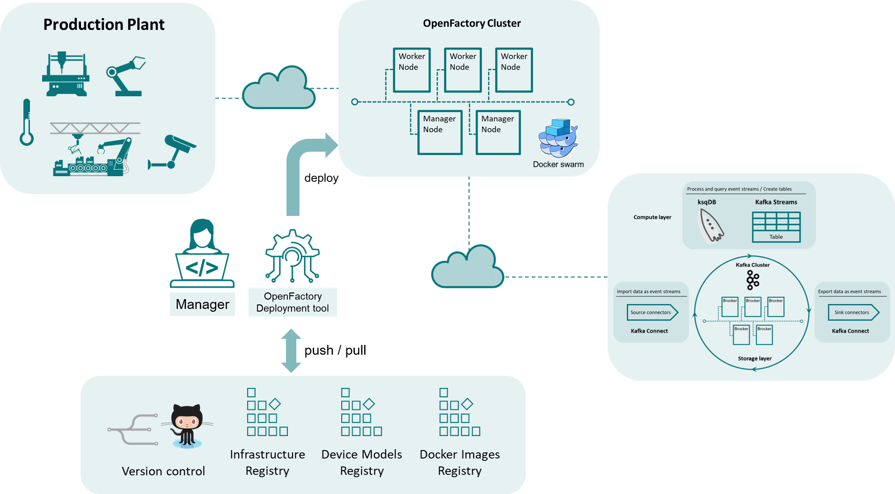
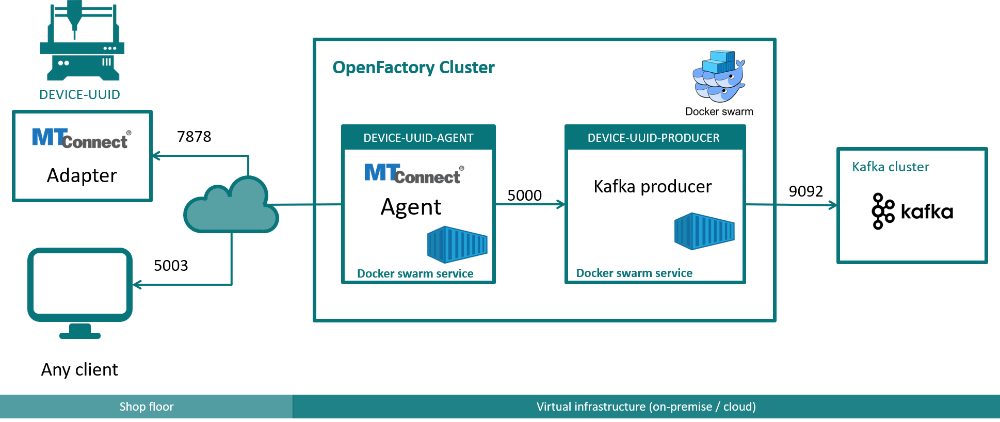
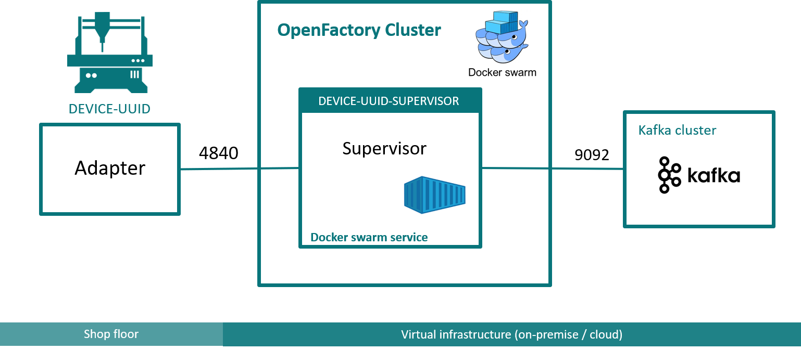

# Architecture  

  

## OpenFactory Cluster  
The OpenFactory cluster orchestrates the flow of information between OpenFactory devices and the Kafka cluster, enabling seamless bidirectional communication and data integration.  

The cluster is built on a [Docker Swarm](https://docs.docker.com/engine/swarm/) architecture, consisting of at least one manager node and optionally one or more worker nodes. Manager nodes handle service orchestration and deployment, while services can run on either manager or worker nodes.  

### Setting Up the OpenFactory Cluster  
Follow these guides to set up the OpenFactory cluster:  
- [Setting Up a Manager Node](../ofa_cluster/ofa_manager_node_setup.md)  
- [Setting Up a Worker Node](../ofa_cluster/ofa_worker_node_setup.md)  

### Configuring the OpenFactory Cluster  
Cluster configuration settings are centralized in the [openfactory.yml](../../openfactory/config/openfactory.yml) file.  

Key variables that may require customization for your environment include:  

- **`OPENFACTORY_USER`**: The OpenFactory user account configured on all cluster nodes.  
- **`OPENFACTORY_MANAGER_NODE`**: The IP address of the OpenFactory manager node.  
- **`SQL_ALCHEMY_CONN`**: The SQLAlchemy connection string for the database used by OpenFactory.  
- **`KAFKA_BROKER`**: The Kafka broker address, formatted as `ip-address:port`.  
- **`KSQLDB_URL`**: The URL of the ksqlDB server, formatted as `http://ip-address:port`.  

For detailed guidance on configuring the [openfactory.yml](../../openfactory/config/openfactory.yml) file, refer to the [documentation](../ofa_cluster/ofa_config_file.md).  

## OpenFactory Information Flow Services  

### Agents  
Agents collect data from OpenFactory devices. OpenFactory uses MTConnect Agents for this purpose. For devices without native MTConnect Agents, OpenFactory can deploy custom agents based on the official [MTConnect C++ Agent](https://github.com/mtconnect/cppagent) from the [MTConnect Institute](https://github.com/mtconnect).  

  

The diagram above illustrates the data collection pipeline for an OpenFactory device with the UUID `DEVICE-UUID`. In this example, OpenFactory deploys:  
- **MTConnect Agent (`DEVICE-UUID-AGENT`)**  
- **Kafka Producer (`DEVICE-UUID-PRODUCER`)**  

These components work together to collect and stream data from the device to the Kafka cluster.  

1. **Adapter**:  
   - Gathers data from the physical device and transmits it to the MTConnect Agent using the [SHDR format](https://www.mtcup.org/Protocol) over port `7878`.  
   - Adapters typically run outside OpenFactory. Examples are available:  
     - [MTCAdapters](https://github.com/Demo-Smart-Factory-Concordia-University/MTCAdapters)  
     - [MTCAdapterRelay](https://github.com/Demo-Smart-Factory-Concordia-University/MTCAdapterRelay)  
   - Developing a custom adapter is straightforward.  

2. **MTConnect Agent**:  
   - Runs as a Docker Swarm service and exposes its HTTP endpoints on port `5003` (in this example).  

3. **Kafka Producer**:  
   - Also runs as a Docker Swarm service, collecting data from the MTConnect Agent and streaming it to the Kafka cluster over port `9092`.  

### Supervisors  
Supervisors handle dispatching commands from the Kafka cluster to OpenFactory devices. Unlike Agents, Supervisors are not based on a specific standard.  

  

In the diagram, the `DEVICE-UUID-SUPERVISOR` Docker Swarm service listens to commands from the Kafka command stream (e.g., `DEVICE_UUID_CMDS_STREAM` on the ksqlDB server). These commands are forwarded to the Adapter, which executes them on the physical device.  

To facilitate development, OpenFactory provides:  
- A base class: [BaseSupervisor](../../openfactory/cmds/supervisor/basesupervisor.py).  
- For [OPC-UA](https://opcfoundation.org) devices: [OPCUASupervisor](../../openfactory/cmds/supervisor/opcuasupervisor.py), which communicates directly with OPC-UA servers.  

The GitHub workflow [opcua_supervisor.yml](../../.github/workflows/opcua_supervisor.yml) builds a Docker image for Supervisors based on the OPCUASupervisor class.  

## OpenFactory Devices  

OpenFactory devices are digital representations of physical devices, adhering to the [MTConnect standard](https://www.mtconnect.org/) for their data information model. However, the command information model must be defined by the OpenFactory user as there is no universal industry standard for commands available.  

For OPC-UA devices, OpenFactory can connect to the device’s OPC-UA server to send commands.  

Each device must have a unique UUID. For this example, we assume the UUID is `DEVICE-UUID`. Once deployed, OpenFactory will create (note that '-' in the device UUID is replaced by '_' in ksqlDB streams/tables names):  

### ksqlDB Streams  
- **`DEVICE_UUID_STREAM`**: Contains all data collected by the device Agent.  
- **`DEVICE_UUID_CMDS_STREAM`**: Contains commands directed to the device (if a Supervisor is deployed).  

### ksqlDB Tables  
- **`DEVICE_UUID`**: Derived from `DEVICE_UUID_STREAM`.  
- **`DEVICE_UUID_AGENT`**: Tracks state information of the device agent.  
- **`DEVICE_UUID_PRODUCER`**: Tracks state information of the Kafka producer.  
- **`DEVICE_UUID_SUPERVISOR`**: Tracks state information of the Supervisor (if deployed).  
- **`DEVICE_UUID_CMDS`**: Derived from `DEVICE_UUID_CMDS` stream (if it exists).

## OpenFactory Deployment Tool  
The OpenFactory deployment tool, [`ofa.py`](../../ofa.py), automates the deployment of services and the creation of device streams and tables in ksqlDB, based on instructions provided in the device configuration files.  

### Key Features:  
- Deploys the required services for OpenFactory devices, such as agents, producers, and supervisors.  
- Automatically creates the necessary streams and tables in ksqlDB for data collection and command handling.  

### Device Configuration File  
The deployment tool relies on device configuration files to define the specifics of each deployment. These files outline the setup for:  
- Device UUID and metadata.  
- Adapter, agent, producer, and supervisor settings.  
- Kafka and ksqlDB stream/table configurations.  

For a detailed description of the structure and usage of device configuration files, refer to this [guide](../../MTConnect/devices/README.md).
